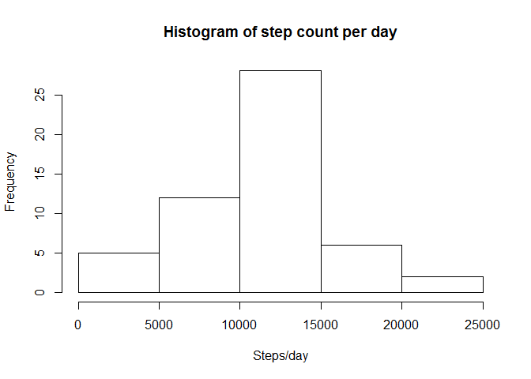
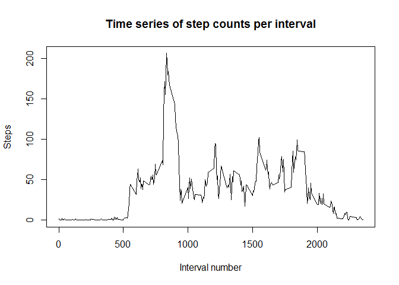
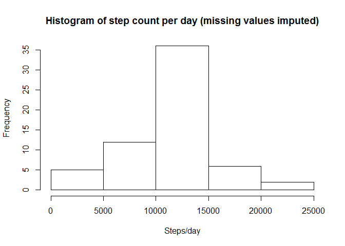
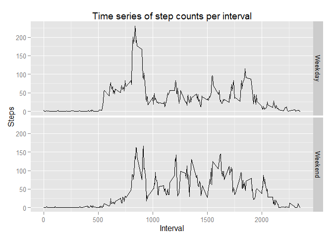

# Reproducible Research: Peer Assessment 1

## Loading and preprocessing the data

- Unzip and read the CSV data file
- Assign appropriate variable classes
- Leave out observations with NA values in the "steps" variable


```r
unzip("repdata%2Fdata%2Factivity.zip")
data <- read.csv("activity.csv")

data$steps <- as.numeric(data$steps)
data$date <- as.character(data$date)
data$interval <- as.numeric(data$interval)

fullObs <- data[!is.na(data$steps),]
```

## What is mean total number of steps taken per day?

Histogram of the total number of steps taken each day:


```r
dailySteps <- aggregate(steps ~ date, data = fullObs, FUN=sum)
hist(dailySteps$steps, main = "Histogram of step count per day", xlab = "Steps/day")
```

 

Means and medians of steps taken per day:


```r
summary(dailySteps$steps)
```

```
##    Min. 1st Qu.  Median    Mean 3rd Qu.    Max. 
##      41    8841   10760   10770   13290   21190
```

## What is the average daily activity pattern?

Time series plot of step counts by 5-minute interval:


```r
intervalMeans <- aggregate(steps ~ interval, data=fullObs, FUN=mean)
plot(intervalMeans, type="l", main = "Time series of step counts per interval", xlab = "Interval number", ylab = "Steps")
```

 

Interval number that contains the maximum number of steps:


```r
intervalMeans$interval[which.max(intervalMeans$steps)]
```

```
## [1] 835
```


## Imputing missing values

Number of observations where "steps" = NA:


```r
table(is.na(data$steps))
```

```
## 
## FALSE  TRUE 
## 15264  2304
```

Impute missing values using the mean value of the corresponding 5-minute interval:


```r
dataImputed <- data

imputes <- function(steps, interval){
    target <- NA
    if (!is.na(steps))
        target <- c(steps)
    else
        target <- (intervalMeans[intervalMeans$interval==interval, "steps"])
    return(target)
}

dataImputed$steps <- mapply(imputes, dataImputed$steps, dataImputed$interval)
```

Histogram of the total number of steps taken each day (including imputed missing values):


```r
dailyStepsImputed <- aggregate(steps ~ date, data = dataImputed, FUN=sum)
hist(dailyStepsImputed$steps, main = "Histogram of step count per day (missing values imputed)", xlab = "Steps/day")
```

 

Means and medians of steps taken per day (including imputed missing values).

The estimates are fairly similar to the values before imputation, with little impact on the total daily number of steps.


```r
summary(dailyStepsImputed$steps)
```

```
##    Min. 1st Qu.  Median    Mean 3rd Qu.    Max. 
##      41    9819   10770   10770   12810   21190
```


## Are there differences in activity patterns between weekdays and weekends?

Create a new factor variable named "weekpart", denoting whether a date is a weekday or weekend day.     


```r
dataImputed$date <- as.Date(dataImputed$date)

weekPart <- function(date){
    day <- weekdays(date)
    if (day %in% c("Monday", "Tuesday", "Wednesday", "Thursday", "Friday"))
        return("Weekday")
    else if (day %in% c("Saturday", "Sunday"))
        return("Weekend")
}

dataImputed$weekpart <- sapply(dataImputed$date, FUN=weekPart)

dataImputed$weekpart <- as.factor(dataImputed$weekpart)
```

Time series plot of step counts by 5-minute interval, split by weekday or weekend days:


```r
library(ggplot2)

stepsWeekpart <- aggregate(steps ~ interval + weekpart, data=dataImputed, mean)

ggplot(stepsWeekpart, aes(interval, steps)) + geom_line() + facet_grid(weekpart ~ .)  + ggtitle("Time series of step counts per interval") + ylab("Steps") + xlab("Interval")
```

 
